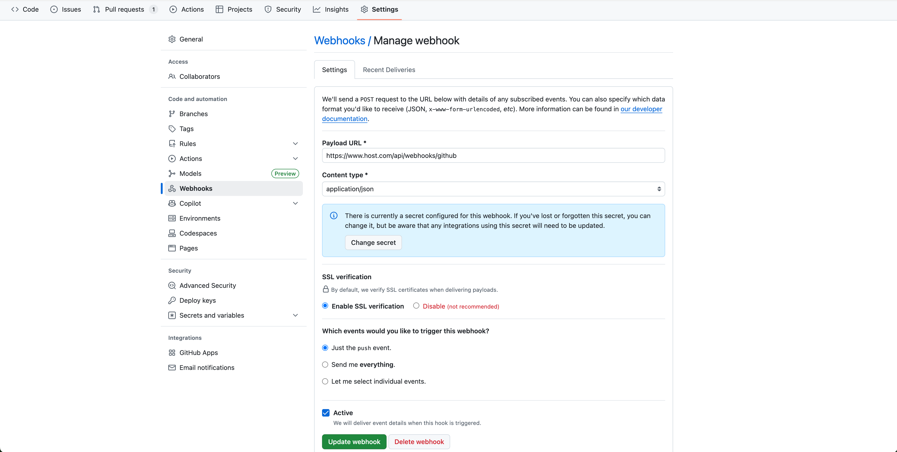
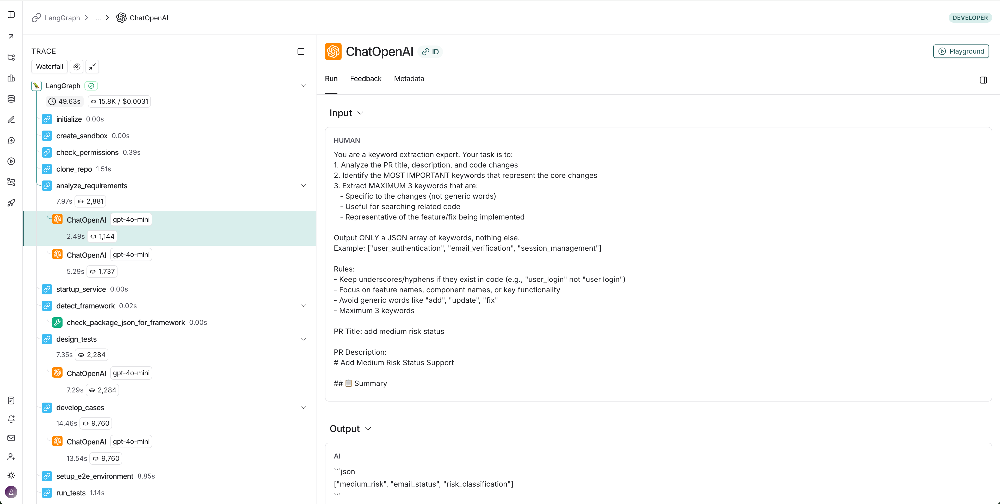

# QAgent - AI驱动的自动化E2E测试生成系统

## 📖 背景

在软件开发过程中，为每个PR编写E2E测试用例是一项耗时且容易出错的工作。QAgent旨在通过AI技术自动化这一过程，从PR分析到测试用例生成、执行，再到结果验证，实现全流程自动化。

### 典型场景示例

假设正在维护一个**邮件风险reviewer系统**，需要添加一个新功能：在现有的"高风险"和"低风险"之外，增加一个"中风险"分类。这个看似简单的需求升级，实际上需要：

1. **需求分析**：理解PR中的变更内容，识别需要测试的功能点
2. **测试设计**：设计覆盖新功能的测试场景
3. **用例开发**：编写具体的E2E测试代码（如Playwright、Cypress等）
4. **测试执行**：在目标环境中运行测试
5. **结果验证**：检查测试是否通过，如有失败需要修复并重试

传统方式下，这个过程需要开发人员手动完成，耗时且容易遗漏。QAgent通过AI Agent自动完成整个流程，大大提升开发效率。

## 🏗️ 系统架构

QAgent采用多Agent协作架构，基于LangGraph进行工作流编排，使用MCP（Model Context Protocol）工具层提供能力支持。

### 核心组件

```
┌─────────────────────────────────────────────────────────┐
│                    FastAPI Web Server                   │
│  ┌──────────────┐  ┌──────────────┐  ┌──────────────┐   │
│  │   Webhooks   │  │    Tasks     │  │    Health    │   │
│  └──────────────┘  └──────────────┘  └──────────────┘   │
└─────────────────────────────────────────────────────────┘
                        │
                        ▼
┌─────────────────────────────────────────────────────────┐
│            LangGraph Workflow Orchestration             │
│  ┌──────────────────────────────────────────────────┐   │
│  │  Initialize → Clone → Analyze → Design → Develop │   │
│  │  → Execute → Review → Retry/Complete             │   │
│  └──────────────────────────────────────────────────┘   │
└─────────────────────────────────────────────────────────┘
                        │
        ┌───────────────┼─────────────────┐
        ▼               ▼                 ▼
┌──────────────────┐ ┌────────────────┐ ┌────────────────┐
│ Business Agents  │ │ MCP Tools      │ │ Infrastructure │
│                  │ │ (High/Mid/Low) │ │ Services       │
├──────────────────┤ ├────────────────┤ ├────────────────┤
│• Requirement     │ │• Git Tools     │ │• Sandbox       │
│  Analyzer        │ │• Search Tools  │ │• Workspace     │
│• Case Designer   │ │• Test Tools    │ │• GitHub        │
│• Case Developer  │ │• File Tools    │ │  Client        │
│• Case Checker    │ │• Cost Control  │ │                │
│• Framework       │ │• Environment   │ │                │
│  Detector        │ │• ...           │ │                │
│• GitHub Agent    │ │                │ │                │
│• Workspace Agent │ │                │ │                │
└──────────────────┘ └────────────────┘ └────────────────┘
        │               │                 │
        └───────────────┼─────────────────┘
                        ▼
              ┌────────────────────┐
              │  LLM Providers     │
              │  (OpenAI/Anthropic)│
              └────────────────────┘
```

### 工作流程

1. **初始化阶段**
   - 接收GitHub Webhook事件（PR opened/synchronize）
   - 创建沙盒环境
   - 检查GitHub权限

2. **准备阶段**
   - 克隆目标仓库到独立workspace
   - 分析PR需求（RequirementAnalyzer）
   - 检测现有测试框架（FrameworkDetector）

3. **设计阶段**
   - 设计测试用例（CaseDesigner）
   - 生成测试代码（CaseDeveloper）
   - 语法检查（TypeScript/JavaScript）

4. **执行阶段**
   - 启动服务
   - 设置E2E测试环境
   - 执行测试用例

5. **验证阶段**
   - 检查测试结果（CaseChecker）
   - 如有失败，提供反馈并重试（最多N次）
   - 通过后创建PR或完成流程

### 测试架构

QAgent采用三层测试金字塔策略：

```
        /\
       /  \  E2E Tests (端到端测试)
      /----\
     /      \  Integration Tests (集成测试)
    /--------\
   /          \  Unit Tests (单元测试)
  /------------\
```

- **单元测试**：快速测试独立组件（MCP工具、Agent方法等）
- **集成测试**：测试组件协作（API端点、工作流编排、Agent协作）
- **E2E测试**：完整工作流测试（真实PR → 测试生成 → 执行）

详细测试策略请参考 [backend/tests/README.md](backend/tests/README.md)

## 🚀 使用方法

### 1. 配置目标项目Webhook

在目标GitHub仓库中配置Webhook，指向QAgent服务：

```
URL: https://your-qagent-domain.com/api/webhooks/github
Content type: application/json
Events: Pull requests, Pushes
Secret: (用于验证)
```



### 2. 启动QAgent服务

```bash
cd backend
./start.sh
```

服务启动后，会监听GitHub Webhook事件。

### 3. 触发工作流

当目标项目有新的PR或push事件时，Webhook会自动触发QAgent工作流：

1. **接收事件** → QAgent接收GitHub Webhook
2. **执行工作流** → 自动执行：分析 → 设计 → 开发 → 执行 → 验证
3. **返回结果** → 响应中包含 `task_id` 和 `langsmith_trace_url`

### 4. 查看LangSmith结果

工作流执行过程中，所有LLM调用都会被记录到LangSmith。你可以通过以下方式查看：

- **立即查看**：Webhook响应中包含 `langsmith_trace_url`，可直接访问
- **完成后查看**：工作流完成后，日志中会打印完整的LangSmith trace URL

**示例**：[LangSmith Trace示例](https://eu.smith.langchain.com/public/9d8fee17-ea7b-4f9a-ad8d-579ec6768a83/r/019b66b2-46ba-7a73-b704-a4e8964b98c2)



LangSmith trace包含：
- 每个Agent的输入输出
- LLM的完整对话历史
- 工具调用详情
- 执行时间和成本

### 示例响应

```json
{
  "status": "accepted",
  "task_id": "550e8400-e29b-41d4-a716-446655440000",
  "message": "Workflow started for PR #1",
  "langsmith_trace_url": "https://eu.smith.langchain.com/o/.../projects/p/...?peek=..."
}
```


## 📊 现状及规划

### 当前状态

✅ **已实现功能**：
- GitHub Webhook集成，支持PR和Push事件触发
- 多Agent协作工作流（需求分析、测试设计、用例开发、结果检查）
- 自动检测现有测试框架（Playwright、Cypress、Selenium等）
- 支持多种LLM提供商（OpenAI、Anthropic），可按Agent配置不同模型
- Self-Refine机制：测试结果检查失败时自动反馈并重试
- LangSmith集成，完整的可观测性
- 完整的测试套件（单元、集成、E2E）

⚠️ **已知问题**：
1. **Webhook稳定性**：当前通过Webhook触发，在某些网络环境下可能不够稳定
2. **Playwright用例稳定性**：生成的Playwright测试用例偶尔会出现失败，需要进一步调试和优化
3. **代码规范**：尚未引入pre-commit，代码风格和规范检查需要手动执行

### 未来规划

1. **CI/CD集成**
   - 集成到GitHub Actions，替代Webhook方式
   - 将LangSmith报告嵌入GitHub Actions的workflow结果中
   - 支持PR评论中自动展示测试结果

2. **代码质量保障**
   - 引入pre-commit hooks，严格遵守代码规范
   - 自动格式化、lint检查、类型检查
   - 提交前自动运行相关测试

3. **测试用例稳定性提升**
   - 优化Playwright用例生成逻辑
   - 增强上下文理解，减少使用不存在方法或变量的情况
   - 改进重试机制，提高成功率

4. **全新项目支持**
   - 支持全新前端项目（尚未建立测试框架的场景）
   - 通过Playwright模板快速初始化测试框架
   - 自动创建测试目录结构、配置文件、基础工具类
   - 生成符合项目架构的初始测试用例模板
   - 支持多种前端框架（React、Vue、Angular等）的适配

5. **性能优化**
   - 优化上下文选择策略（grep、搜索、函数块等）
   - 构建项目记忆数据结构，提高引用效率
   - 引入Planner机制，让AI更好地规划测试生成任务

6. **成本优化**
   - 针对不同任务选择不同厂商和模型，平衡性能和价格
   - 优化token使用，减少不必要的上下文传递
   - 评估AI模型升级后的效果和成本

## 🤖 如何借助AI加速

在QAgent项目的开发过程中，AI在以下方面显著提升了工作效率：

### 1. 脚手架构建
- 使用AI快速生成项目基础架构代码
- 自动创建FastAPI路由、Agent基类、MCP工具模板等
- 大大减少重复性工作

### 2. 代码重构
- 将原有功能重构为Agent模式时，AI帮助快速识别需要封装的方法
- 自动生成工具装饰器和Agent包装代码
- 保持代码风格一致性

### 3. 不熟悉技术的快速上手
- LangGraph工作流编排：通过AI理解LangGraph的状态管理和条件边
- MCP工具开发：快速掌握工具装饰器和上下文传递机制
- LangSmith集成：理解trace和observability的最佳实践

### 4. Cursor的Debug模式
- 使用Cursor的debug模式快速定位问题
- AI帮助分析错误堆栈，识别根本原因
- 自动生成修复建议和测试用例

### 5. 文档编写
- 自动生成API文档、架构说明、使用指南
- 保持文档与代码同步
- 生成清晰的示例和说明

## 💡 记录与思考

在开发和使用QAgent的过程中，我们总结了一些重要的经验和考虑：

### 1. AI擅长与不擅长的方面

**AI擅长的**：
- ✅ 需求分析和用例设计：AI能够很好地理解PR描述，识别测试场景
- ✅ 代码结构理解：能够分析现有代码库，理解项目架构
- ✅ 测试策略规划：能够设计合理的测试覆盖方案

**AI不擅长的**：
- ❌ 具体代码实现细节：生成的测试用例经常使用不存在的方法或变量
- ❌ 项目特定的约定和模式：需要大量上下文才能理解项目特有的编码风格
- ❌ 环境配置和依赖：对运行环境的理解有限

**解决方案**：
- 提供丰富的上下文（相关文件、现有测试用例、Page Objects等）
- 实现Self-Refine机制，通过反馈循环不断改进
- 结合语法检查和实际执行结果进行验证

### 2. Playwright用例生成的工程角度

**当前方案**：
- 读取所有相关文件（测试文件、Page Objects、Helpers等）
- 通过上下文发送给LLM
- LLM基于上下文生成测试代码

**未来优化方向**：
- 考虑直接上传文件到LLM，而不是读取后作为文本传递
- 使用向量数据库存储项目记忆，提高检索效率
- 按函数/方法块组织上下文，而不是整文件传递

### 3. Agentic RAG的挑战

**直接使用Cursor vs 构建Agentic RAG**：

- **直接使用Cursor**：对于"中风险"这样的需求，可能一个指令就能完成case生成
- **构建Agentic RAG**：需要解决多个难点才能实现自动化

**主要难点**：

1. **上下文选择**：
   - 方式：grep、语义搜索、文件分析
   - 大小：前100行、全部文件、按函数方法块
   - 平衡：太少可能遗漏关键信息，太多可能超出token限制

2. **项目记忆数据结构**：
   - 需要构建可复用的项目知识库
   - 支持快速检索和引用
   - 保持与代码库同步

3. **Planner机制**：
   - AI擅长规划，但需要合适的工具和上下文
   - 需要将大任务分解为小步骤
   - 每个步骤需要明确的输入输出

4. **模型选择与成本权衡**：
   - 不同任务需要不同能力的模型
   - 需求分析：可以使用较便宜的模型
   - 代码生成：需要较强的代码理解能力
   - 结果检查：需要最强大的模型确保质量
   - 平衡性能和价格是关键

5. **不确定性与确定性的矛盾**：
   - AI具有高不确定性：同样的输入可能产生不同的输出
   - 测试用例需要高确定性：必须能够稳定执行
   - 需要通过多次验证、语法检查、实际执行来消除不确定性

### 4. 成本问题

**Token成本**：
- LLM调用是主要成本来源
- 上下文越大，成本越高
- 需要优化上下文选择策略

**时间成本**：
- 现阶段：使用人来消除不确定性和信息差，可能比AI自己在RAG环中不停尝试更节省时间和成本
- 未来：随着AI能力提升和系统优化，自动化程度会越来越高

**优化策略**：
- 按任务选择合适的模型（便宜模型用于简单任务，强大模型用于关键任务）
- 优化上下文传递，只传递必要信息
- 实现智能缓存，避免重复分析相同内容

### 5. AI模型升级后的评估

**评估维度**：
- **准确性**：生成的测试用例是否正确
- **稳定性**：相同输入是否产生一致输出
- **成本**：Token使用和API调用成本
- **速度**：响应时间和执行效率

**持续改进**：
- 建立评估指标体系
- 定期对比不同模型版本的效果
- 根据评估结果调整模型选择和配置

## 🛠️ 开发说明

本项目采用AI辅助开发方式，在短时间内完成了从架构设计到功能实现的完整开发流程。

### 开发周期
- **开发时间**：4天
- **开发方式**：AI驱动的快速迭代开发

### 开发工具
- **Cursor**：主要IDE，利用AI代码补全和对话功能
- **Qoder**：辅助代码生成和重构工具
- **Vibe Coding工具**：用于快速原型开发和代码生成

### 使用的大模型
在开发过程中使用了以下大语言模型：

- **OpenAI GPT系列**：
  - `gpt-4o-mini`：用于日常代码生成和问题解答
  - `gpt-5.1-codex`：用于复杂代码逻辑和架构设计

- **Anthropic Claude系列**：
  - `claude-3-7-sonnet`：用于需求分析和测试用例设计
  - `claude-opus-4-5`：用于关键代码审查和架构优化

### 开发体验
通过AI辅助开发，实现了：
- 快速搭建项目架构和脚手架
- 高效的代码重构和模式转换
- 快速学习新技术栈（LangGraph、MCP等）
- 自动化测试用例生成
- 文档自动生成和维护

这种开发方式大大提升了开发效率，使得在短时间内完成一个复杂的多Agent系统成为可能。

## 📚 相关文档

- [快速开始指南](docs/quick_start.md) - 快速上手QAgent
- [项目结构说明](docs/project_structure.md) - 详细的代码组织结构
- [后端README](backend/README.md) - 后端服务详细文档
- [测试策略](backend/tests/README.md) - 测试架构和策略说明


## 📄 License

[待添加]

## 🤝 Contributing

[待添加]

